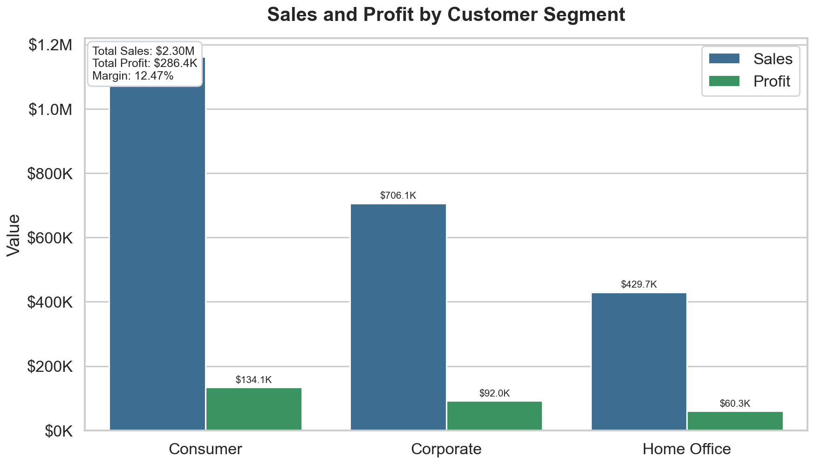
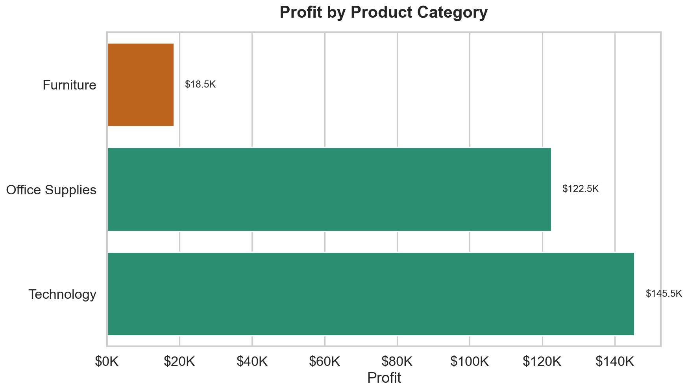
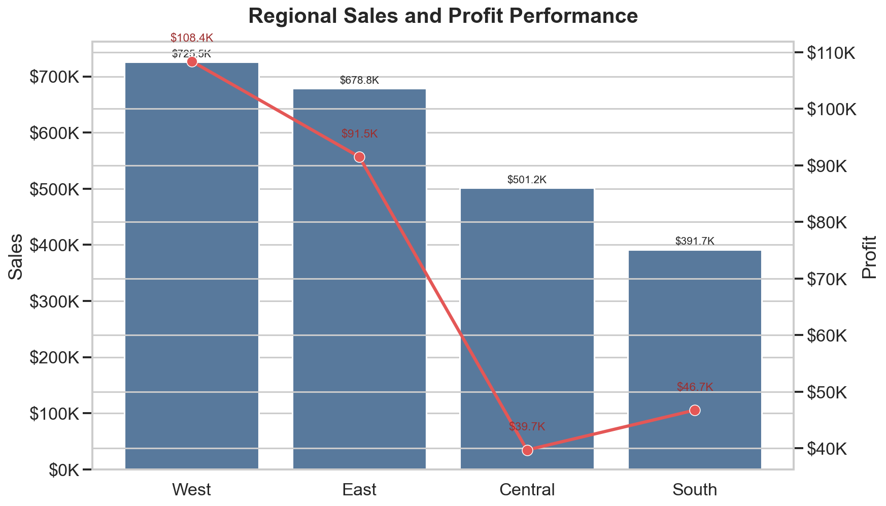

# Sales Performance Analysis


## Overview

Retail sales performance analysis built with Python to identify revenue drivers, profit leakage, regional performance gaps, and discount-related margin risk. The project converts order-level transaction data into business-ready KPIs, visual insights, and recommendations for improving profitability.

## Executive Summary

| KPI | Result |
|---|---:|
| Total Sales | $2,297,200.86 |
| Total Profit | $286,397.02 |
| Profit Margin | 12.47% |
| Top Region by Sales | West |
| Top Category by Profit | Technology |
| Most Profitable Sub-Category | Copiers |
| Highest Loss Area | Tables / Furniture Discounts |

## Visual Preview







## Business Objective

The analysis focuses on the core questions a retail leadership team would need answered:

- Which products and categories generate the strongest profit?
- Which regions deliver the best sales and margin performance?
- Which customer segments contribute the most revenue?
- Where is discounting creating negative profit?
- Which areas should be prioritized to improve overall profitability?

## Data Source

Dataset: Superstore retail transaction data from Kaggle<br>
Source: https://www.kaggle.com/datasets/vivek468/superstore-dataset-final

The dataset includes product-level order records with sales, profit, discount, customer segment, product category, sub-category, region, and order dates.

## Data Profile

| Metric | Value |
|---|---:|
| Records | 9,994 |
| Original Columns | 22 |
| Period Covered | 2014-2017 |
| Grain | Product-level order line |

Key fields used in the analysis:

- Order Date
- Region
- Category
- Sub-Category
- Segment
- Sales
- Profit
- Discount

## Deliverables

- Cleaned analysis-ready dataset
- KPI summary for sales, profit, margin, and top performers
- Product, region, and customer segment profitability analysis
- Exported visual assets for portfolio presentation
- Executive insights report: `reports/insights_summary.md`
- Business recommendations focused on margin improvement

## Tools

- Python
- Pandas
- NumPy
- Matplotlib
- Seaborn
- Jupyter Notebook

## Workflow

| Notebook | Purpose |
|---|---|
| `1_Data_Understanding.ipynb` | Load raw data, inspect schema, validate quality, and create the first cleaned file. |
| `2_Data_Cleaning.ipynb` | Standardize date fields and prepare the dataset for analysis. |
| `3_EDA.ipynb` | Calculate KPIs and analyze category, sub-category, region, and segment performance. |
| `4_Visualizations.ipynb` | Create and export visual summaries for sales, profit, and regional performance. |
| `5_Business_Insights.ipynb` | Convert analysis outputs into business insights and recommendations. |

## Key Findings

- Technology is the strongest profit category with $145,454.95 in profit, contributing 50.8% of total profit and delivering a 17.4% margin.
- Copiers are the highest-profit sub-category with $55,617.82 in profit from $149,528.03 in sales, producing a 37.2% margin.
- Tables are the largest loss-making sub-category, with -$17,725.48 in profit despite $206,965.53 in sales. Average discounting on Tables is 26.1%.
- The West region leads performance with $725,457.82 in sales and $108,418.45 in profit, contributing 31.6% of sales and 37.9% of profit.
- The Consumer segment is the largest revenue contributor with $1,161,401.34 in sales, representing 50.6% of total sales.
- Furniture has weak profitability: $741,999.80 in sales but only $18,451.27 in profit, a 2.5% margin.
- The Central region underperforms on margin, generating $39,706.36 profit on $501,239.89 in sales with the highest average discount level among regions.

## Recommendations

- Tighten discount controls on Furniture, especially Tables, to stop high-volume orders from reducing total profit.
- Prioritize Technology promotions, with special focus on Copiers because of their strong margin profile.
- Review pricing and discount approvals in the Central region to improve margin quality.
- Use Consumer segment volume for targeted retention, cross-sell, and high-margin product campaigns.
- Maintain strong execution in the West region because it leads both revenue and profit contribution.

## Project Structure

```text
sales-performance-analysis/
|-- data/
|   |-- Sample - Superstore.csv
|   |-- cleaned_data.csv
|   |-- cleaned_data_for_EDA.csv
|   |-- cleaned_data_for_EDA_visualization.csv
|-- notebooks/
|   |-- 1_Data_Understanding.ipynb
|   |-- 2_Data_Cleaning.ipynb
|   |-- 3_EDA.ipynb
|   |-- 4_Visualizations.ipynb
|   `-- 5_Business_Insights.ipynb
|-- assets/
|   `-- screenshots/
|       |-- sales_overview.png
|       |-- category_profit.png
|       `-- regional_performance.png
|-- reports/
|   `-- insights_summary.md
|-- requirements.txt
`-- README.md
```

## How to Run

```bash
git clone https://github.com/Bilalshafiq139/sales-performance-analysis.git
cd sales-performance-analysis
pip install -r requirements.txt
python -m notebook
```

Open and run the notebooks in order:

1. `notebooks/1_Data_Understanding.ipynb`
2. `notebooks/2_Data_Cleaning.ipynb`
3. `notebooks/3_EDA.ipynb`
4. `notebooks/4_Visualizations.ipynb`
5. `notebooks/5_Business_Insights.ipynb`

## Author

**Bilal Shafique**<br>
Data Analyst | Python | SQL | Power BI | Excel<br>
LinkedIn: https://www.linkedin.com/in/bilal-shafique<br>
GitHub: https://github.com/Bilalshafiq139
